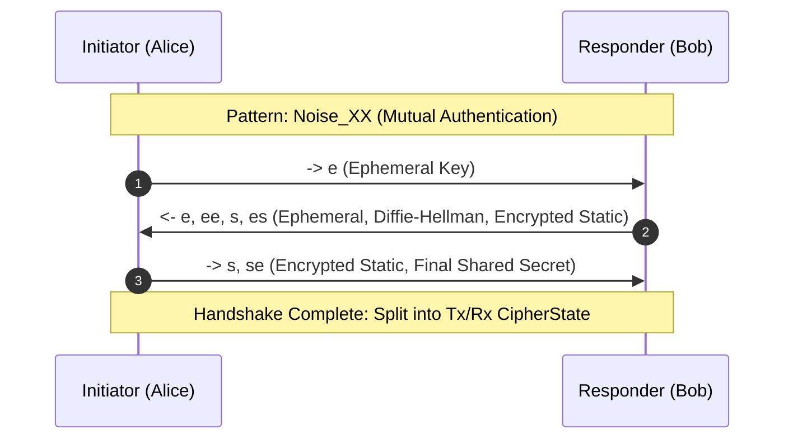

# RFC-Draft: The Kite Mesh Transport Protocol Specification

**Status:** Standards Track (Experimental)  
**Author:** Kite Protocol Architecture Group  
**Version:** 1.0.0-draft  
**Date:** August 2026  

---

## Abstract

This document defines the wire format, state machines, and opportunistic store-carry-forward routing mechanics of **Kite** — a zero-allocation, delay-tolerant mesh transport protocol optimized for degraded, intermittent, or actively monitored RF environments.

---

## 1. Introduction & Design Philosophy

Traditional networking stacks (TCP/IP) rely on three assumptions that fail in contested or infrastructureless environments:
1. Continuous end-to-end topological path availability.
2. Low round-trip delay suitable for interactive handshakes.
3. Plaintext or structured framing vulnerable to Deep Packet Inspection (DPI) and radio fingerprinting.

Kite replaces these assumptions with an **opportunistic delay-tolerant transport** coupled with **uniform entropy obfuscation** and the **Noise_XX mutual authentication handshake**.

---

## 2. Wire Framing Specification

All Kite over-the-air frames conform to a deterministic, 28-byte minimum header layout followed by variable-length payload and a trailing 32-bit CRC.

```text
 0                   1                   2                   3
 0 1 2 3 4 5 6 7 8 9 0 1 2 3 4 5 6 7 8 9 0 1 2 3 4 5 6 7 8 9 0 1
+-+-+-+-+-+-+-+-+-+-+-+-+-+-+-+-+-+-+-+-+-+-+-+-+-+-+-+-+-+-+-+-+
|  Version (1)  |Frame Type (1) |   Flags (1)   |    TTL (1)    |
+-+-+-+-+-+-+-+-+-+-+-+-+-+-+-+-+-+-+-+-+-+-+-+-+-+-+-+-+-+-+-+-+
|                       Source Address (8)                      |
|                                                               |
+-+-+-+-+-+-+-+-+-+-+-+-+-+-+-+-+-+-+-+-+-+-+-+-+-+-+-+-+-+-+-+-+
|                    Destination Address (8)                    |
|                                                               |
+-+-+-+-+-+-+-+-+-+-+-+-+-+-+-+-+-+-+-+-+-+-+-+-+-+-+-+-+-+-+-+-+
|        Sequence (2)           |       Payload Length (2)      |
+-+-+-+-+-+-+-+-+-+-+-+-+-+-+-+-+-+-+-+-+-+-+-+-+-+-+-+-+-+-+-+-+
|                        Payload (0..484 B)                     |
|                               ...                             |
+-+-+-+-+-+-+-+-+-+-+-+-+-+-+-+-+-+-+-+-+-+-+-+-+-+-+-+-+-+-+-+-+
|                        CRC32 Checksum (4)                     |
+-+-+-+-+-+-+-+-+-+-+-+-+-+-+-+-+-+-+-+-+-+-+-+-+-+-+-+-+-+-+-+-+
```

### 2.1 Frame Header Fields

| Field | Size (Bytes) | Description |
| :--- | :--- | :--- |
| **Version** | 1 | Protocol version byte (Current: `0x01`). |
| **Frame Type** | 1 | `0x01` (Beacon), `0x02` (Data), `0x03` (Ack), `0x04` (Gossip), `0x05` (Handshake). |
| **Flags** | 1 | Bit 0: `ENCRYPTED`, Bit 1: `URGENT`, Bit 2: `STORE_AND_FORWARD`, Bit 3: `PROBE`. |
| **TTL** | 1 | Time-To-Live hop counter. Decremented by 1 at each relay hop. |
| **Source Address** | 8 | Truncated 64-bit cryptographic identity of sender. |
| **Destination Address** | 8 | Target address or `0xFFFFFFFFFFFFFFFF` for link-layer broadcast. |
| **Sequence Number** | 2 | Big-endian monotonically increasing packet sequence ID. |
| **Payload Length** | 2 | Big-endian length of the following payload slice ($0 \le N \le 484$). |
| **CRC32** | 4 | IEEE 802.3 32-bit cyclic redundancy checksum calculated over offset `0..(24 + N)`. |

---

## 3. Cryptographic State Machine

Kite enforces end-to-end forward secrecy and mutual authentication via the **Noise_XX_25519_ChaChaPoly_SHA256** handshake pattern.



---

## 4. Delay-Tolerant Opportunistic Routing

When topological paths between source $S$ and destination $D$ are disrupted, intermediate nodes $N_i$ act as opportunistic data ferries under the **Store-Carry-Forward** paradigm.

### 4.1 Replication Budget Decay
To prevent buffer bloat in high-density meshes, multi-copy replication follows a binary split budget:

$$\mathcal{R}_{\text{child}} = \left\lfloor \frac{\mathcal{R}_{\text{parent}}}{2} \right\rfloor$$

When $\mathcal{R} = 1$, the node switches to non-replicating single-custody direct delivery.
